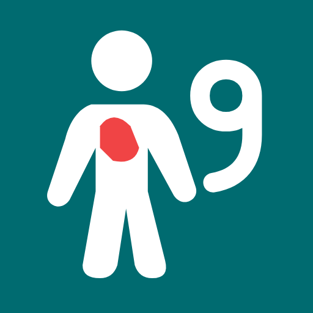

# BurnMap 9 — Adult Rule of Nines



Native Kotlin, Jetpack Compose and MVVM adult burn-area estimator. Front and back drawings are independent and analyzed together. No patient identifiers, database, network calls, or session persistence.

## Download

[Download BurnMap 9 v0.3 debug APK](https://github.com/sherifrad/burnmap9-android/releases/download/v0.3-debug/BurnMap9-v0.3-debug.apk) · [SHA-256 checksum](https://github.com/sherifrad/burnmap9-android/releases/download/v0.3-debug/BurnMap9-v0.3-debug.apk.sha256) · [Release details](https://github.com/sherifrad/burnmap9-android/releases/tag/v0.3-debug)

This debug-signed prerelease requires Android 8/API 26 or later. Its validated source commit is `eab2adc50aba0a02db068023572631c0b76e24f3`. Expected APK SHA-256: `621068c975c1a1a1f8698badf4aeba9ee11f388478f5222fb45e9d183c3b1d9b`.

## Build

Use JDK 17 and Android SDK 36. Set `sdk.dir` in `local.properties` for your machine.

```sh
./gradlew :app:testDebugUnitTest :app:lintDebug :app:assembleDebug :app:assembleDebugAndroidTest
ANDROID_SERIAL=<authorized-Honor-serial> ./gradlew :app:connectedDebugAndroidTest -Pandroid.injected.androidTest.leaveApksInstalledAfterRun=true
```

Toolchain: Gradle 8.13, AGP 8.13.2, Kotlin and Compose compiler plugin 2.2.21, Compose BOM 2025.12.01; minimum Android 8/API 26, target API 36. Dependencies are pinned in the Gradle files. Version 0.3 is available as `BurnMap9-v0.3-debug.apk`, debug-signed for owner testing. The application package stays `com.drsherif.ruleofnines` for update continuity.

## Use

On a fresh app session, the welcome screen shows the same launcher logo and the credit “Made with ❤️ by Omar El-gazzar and Sol” along the lower safe edge. It advances automatically after 1.2 seconds; tap anywhere to open the map immediately. It does not repeat when resuming or rotating the calculator.

1. Select Front or Back. Anatomical patient right/left are labeled; the front view mirrors the viewer.
2. Tap or drag over partial/full-thickness burned areas with the red brush. Adjust brush size as needed. Exclude superficial erythema.
3. Press **Analyze both views**. The total is percent total body surface area (TBSA). Each row separately shows how much of that anatomical region is painted and its TBSA contribution.
4. Drawing again hides the old total. Reanalyze to refresh. **Clear all** requires confirmation and resets both views.

Rotation and background/resume preserve the in-memory session. Process death or a cold app restart starts a new session. No undo, eraser, zoom, pediatric weights, fluid calculations or treatment recommendations are included.

## Adult weighting

| Region | Front | Back | Whole region |
|---|---:|---:|---:|
| Head and neck | 4.5 | 4.5 | 9 |
| Right arm, including hand | 4.5 | 4.5 | 9 |
| Left arm, including hand | 4.5 | 4.5 | 9 |
| Trunk | 18 | 18 | 36 (reported as two regions) |
| Right leg, including foot | 9 | 9 | 18 |
| Left leg, including foot | 9 | 9 | 18 |
| Perineum | 1 | — | 1 |
| **Total** | **50.5** | **49.5** | **100** |

The owner approved the 50.5/49.5 split. Source: [American Burn Association](https://www.ameriburn.org/burn-care-team/resources/guidelines-for-burn-patient-referral). Schematic anatomy and this implementation still require owner/clinical review before clinical use. A two-dimensional within-region pixel fraction estimates coverage; it is not a measurement of curved three-dimensional surface area.

For each surface, contribution = painted fraction × weight in percentage units. Whole-region coverage = sum of those contributions ÷ whole-region weight. Thus 50% of the anterior right arm contributes 2.25% TBSA and represents 25% of the whole right arm. Unrounded Doubles are summed; display rounds to one decimal.

## Drawing and analysis contract

- `BodyDiagramFactory` generates base art and exact-color maps from shared paths at 512 × 1024. Hidden maps are immutable software ARGB_8888 bitmaps with classification antialiasing disabled. Base/map alpha support is identical.
- `PaintController` owns separate transparent red buffers on the main thread. Compose Paths and round dots rasterize in canonical coordinates; inverse aspect-fit transforms include letterboxing.
- `BodyPaintCanvas` draws the base, then isolates a layer containing the silhouette as destination and the complete paint bitmap as `SrcIn` source. The composited base is never analyzed.
- Analyze makes independent immutable paint snapshots on the main thread. Worker-local masked overlays and pixel scans run on `Dispatchers.Default`. Only pure red pixels with alpha ≥128 count. Antialiased boundary pixels use this documented binary threshold. Overlapping strokes count once.
- The analyzer caches region labels/denominators only for immutable map identities. Wrong dimensions, unsupported bitmap formats, unknown opaque map colors and empty required regions fail explicitly. Row-level cancellation and revision checks prevent stale publication.
- Results collect lifecycle-aware StateFlow separately from the canvas. A real-device test measures the canvas composition count across result publication.

## Icon and branding

BurnMap 9 combines body mapping with the adult Rule of Nines. Its launcher icon uses a teal background, white body silhouette and 9, and a red painted patch. Native adaptive vector resources include an Android 13 monochrome layer; no bitmap assets or new runtime dependencies are needed.

## Validation

See the [public validation summary](docs/VALIDATION.md). The debug APK and checksum are published as GitHub release assets. Detailed build logs, raw phone reports and screenshots remain local under ignored `outputs/`; SDK paths, signing keys and credential files are also excluded from the public repository. Engineering validation is reported separately from owner anatomy/clinical acceptance.

Public availability does not constitute clinical approval. No license grant is specified by this repository.
